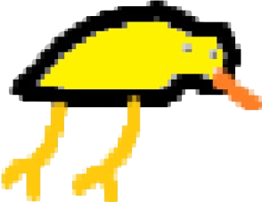
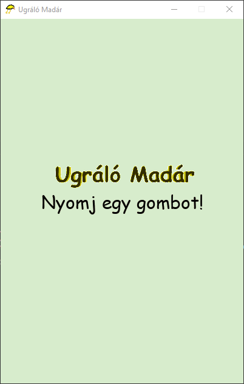
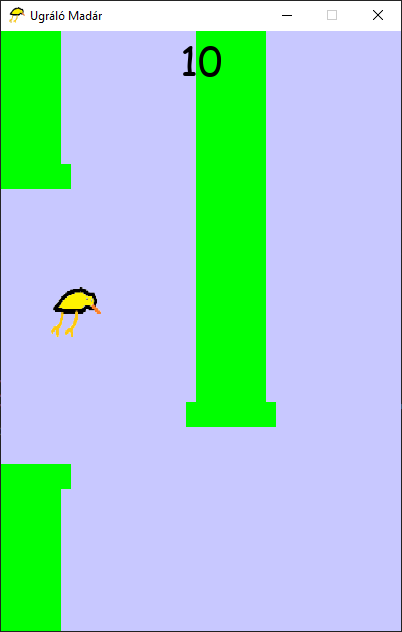
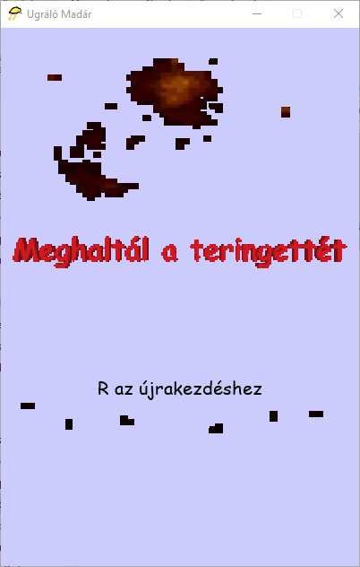

# Ugráló Madár

##  Flappy Bird, but without a budget

**Ugráló Madár** is a Python-based game inspired by the popular Flappy Bird, created using the Pygame library. The objective of the game is to control a bird and guide it through obstacles while avoiding collisions. The game progressively becomes more challenging as you score higher.

## Table of Contents

- [Ugráló Madár](#ugráló-madár)
  - [ Flappy Bird, but without a budget](#-flappy-bird-but-without-a-budget)
  - [Table of Contents](#table-of-contents)
  - [Features](#features)
  - [Requirements](#requirements)
  - [Installation](#installation)
  - [How to Play](#how-to-play)
  - [Game Controls](#game-controls)
  - [Known Issues](#known-issues)
  - [Credits](#credits)
  - [Screenshots](#screenshots)
  - [License](#license)
  - [Showcase Video](#showcase-video)
  - [Attributions](#attributions)

## Features

- Classic Flappy Bird-inspired gameplay. (it's low quality on purpose)
- Randomly generated pipe obstacles.
- Simple, responsive controls.
- Scoring system that tracks how far you progress.
- Game-over screen with final score display.

## Requirements

- **Python 3.6+**
- **Pygame 2.x**
- **gif-pygame 1.1.x**

You can install the required dependencies by running:

```bash
pip install -r requirements.txt
```

## Installation

1. Clone this repository to your local machine:

   ```bash
   git clone https://github.com/kriszsusu/ugralo-madar.git
   ```

2. Navigate to the game directory:

   ```bash
   cd ugralo-madar
   ```

3. Run the game:

   ```bash
   python ugralomadar.py
   ```

## How to Play

1. Upon starting the game, a title screen will appear, and you can start the game by pressing any key. (please don't press alt+f4)
2. Guide the bird through the gaps between the pipes by controlling its altitude.
3. The game ends if the bird collides with a pipe ~~or the ground~~.
4. Your score increases by passing through pipes.

The objective is to survive as long as possible and achieve the highest score!

## Game Controls

- **Jump**: Press the **Spacebar** to make the bird flap and rise.
- **Quit**: Click the **native Close button**.

## Known Issues

- Hitbox detection can sometimes feel inaccurate on rare occasions.
- Pygame window resizing may not be supported properly.
- The game graphics is too complicated for the human brain to process.

## Credits

- **Web Development**: [Dzsanga](https://github.com/DzsangaGIT)
- **Game Development**: [Krisz](https://github.com/kriszsusu), [Dzsanga](https://github.com/DzsangaGIT)
- **Graphics**: [Bakos](https://github.com/BAKOSDOMI), [Krisz](https://github.com/kriszsusu), [Dzsanga](https://github.com/DzsangaGIT) (Microsoft Paint 🤩)
- **SFX**: Audacity + Freesound.org
- **Background Music**: Waiter White by TCH FakeFan

Special thanks to the creators of Pygame for making this project possible!

## Screenshots





## License

This project is licensed under the MIT License. Feel free to modify and share the code, but please provide proper attribution when using it in your projects.

## Showcase Video

This video was recorded and created by <a href="https://www.youtube.com/@csiguszfoxoup" target="_blank">Csigusz Foxoup</a>. All props to him! - <a href="https://www.youtube.com/watch?v=T_3cFiQcfu4">https://www.youtube.com/watch?v=T_3cFiQcfu4</a>

## Attributions

- Wing Flap 1.wav by _stubb -- https://freesound.org/s/389634/ -- License: Creative Commons 0
- Video Game Coin by harrietniamh -- https://freesound.org/s/415083/ -- License: Attribution 4.0
- OldTrombone - G#2 (Trombone_Fall_G#2_1.wav) by sgossner -- https://freesound.org/s/374751/ -- License: Creative Commons 0

---

Enjoy playing **Ugráló Madár**! Feel free to contribute to the project by reporting issues, suggesting features, or submitting pull requests.
